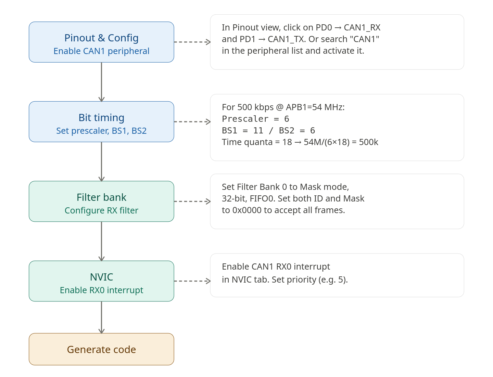

# ak-c-drivers

C driver library for CubeMars AK series motors over CAN bus.
Supports both MIT mode and Servo mode communication protocols.

---

## Overview

* Provides message generation and decoding for CubeMars AK brushless motors
* Intended for robotics engineers and embedded developers using Linux with SocketCAN
* Fills the gap between the manufacturer PDF and working code — no dependencies, no bloat

---

## Features

* MIT mode: position/velocity/torque control with configurable gains (kp, kd, t_ff)
* Servo mode: duty cycle, current, RPM, position, and position+speed control
* CAN feedback decoding (position, speed, current, temperature, error)
* Supports 10 motor models out of the box (AK10-9, AK40-10, AK60-6, AK70-10, AK80-6/8/9/64, AK45-10/36)
* Interactive ncurses TUI demo with live CAN monitoring

---

## Tech Stack

* Language: C17
* Infrastructure: Linux SocketCAN
* Other tools: CMake 3.28+, ncurses (demo only)

---

## Installation

```bash
# Build library and demo
cmake -B build
cmake --build build
```

The static library `libcubemars-drivers.a` and the `demo` binary will be placed in `build/`.

To link the library in your own project:

```cmake
add_subdirectory(ak-c-drivers)
target_link_libraries(your_target PRIVATE cubemars-drivers)
```

---

## Configuration

No environment variables are required. The CAN interface name and motor ID are set at runtime (either in code or via the demo TUI).

To bring up a CAN interface before use:

```bash
sudo ip link set can0 type can bitrate 1000000
sudo ip link set can0 up
```

---

## Usage

### Servo mode — send a position command

```c
#include "ak_servo.h"
#include <linux/can.h>

uint8_t motor_id = 1;
struct can_frame frame;
AKMotorServoMessage msg;

msg = generate_position_message(motor_id, 90.0f);  // 90 degrees
frame.can_id  = msg.id | CAN_EFF_FLAG;
frame.can_dlc = 8;
memcpy(frame.data, msg.data, 8);
// write(can_socket, &frame, sizeof(frame));
```

### MIT mode — torque-controlled command

```c
#include "ak_mit.h"
#include <linux/can.h>

uint8_t motor_id = 1;
MotorModel model = AK80_9;   // pick your motor
struct can_frame frame;
AKMotorMITMessage msg;

// Enter MIT mode first
msg = generate_mit_enter_message(motor_id);
// ... write to socket ...

// Send control command: hold position 0 with soft gains
msg = generate_mit_command_message(motor_id, model,
        /*p_des=*/0.0f, /*v_des=*/0.0f,
        /*kp=*/5.0f,    /*kd=*/0.5f,
        /*t_ff=*/0.0f);
frame.can_id  = msg.id;
frame.can_dlc = 8;
memcpy(frame.data, msg.data, 8);
// write(can_socket, &frame, sizeof(frame));
```

### Decoding feedback (Servo mode)

```c
#include "ak_servo.h"

struct can_frame rx;
// read(can_socket, &rx, sizeof(rx));

ServoCANFeedback fb = decode_servo_can_feedback(rx.data);
printf("pos=%.2f deg  speed=%d ERPM  current=%.2f A  temp=%d°C\n",
       fb.position, fb.speed, fb.current, fb.temperature);
```

### STM32 Nucleo (HAL bxCAN) — send and receive a position command

The library has no OS dependencies, so the same message-building functions work on bare metal. Only the transmit/receive calls change.



**Servo mode — position command:**

```c
#include "ak_servo.h"
#include "stm32f4xx_hal.h"   // adjust for your series

extern CAN_HandleTypeDef hcan1;

void send_position(uint8_t motor_id, float deg)
{
    AKMotorServoMessage msg = generate_position_message(motor_id, deg);

    CAN_TxHeaderTypeDef hdr = {
        .ExtId = msg.extended_id,
        .IDE   = CAN_ID_EXT,
        .RTR   = CAN_RTR_DATA,
        .DLC   = msg.len,
    };
    uint32_t mailbox;
    HAL_CAN_AddTxMessage(&hcan1, &hdr, msg.data, &mailbox);
}
```

**Receiving feedback (polling):**

```c
void poll_feedback(void)
{
    if (HAL_CAN_GetRxFifoFillLevel(&hcan1, CAN_RX_FIFO0) == 0)
        return;

    CAN_RxHeaderTypeDef hdr;
    uint8_t rx[8];
    HAL_CAN_GetRxMessage(&hcan1, CAN_RX_FIFO0, &hdr, rx);

    ServoCANFeedback fb = decode_servo_can_feedback(rx);
    // fb.position (deg), fb.speed (ERPM), fb.current (A), fb.temperature (°C)
}
```

Configure the CAN peripheral for 1 Mbit/s in CubeMX (or manually set the prescaler/timing registers), and add an acceptance filter that passes the motor's feedback frame ID before calling `HAL_CAN_Start()`.

---

### Demo TUI

The `demo` binary is a fully interactive ncurses application for exploring and testing motor commands without writing any code.

```bash
./build/demo
```

Key bindings inside the TUI:

| Key | Action |
|-----|--------|
| `↑ / ↓` | Navigate command list |
| `Enter` | Edit parameters and send command |
| `i` | Set CAN interface name |
| `u` | Bring interface up (prompts for bitrate) |
| `d` | Bring interface down |
| `m` | Set motor ID (1–255) |
| `D` | Toggle live CAN dump (ring buffer, 200 frames) |
| `q` | Quit |

The three right-hand panels show the editable parameters for the selected command, the last transmitted CAN frame, and the latest decoded motor feedback in real time.
